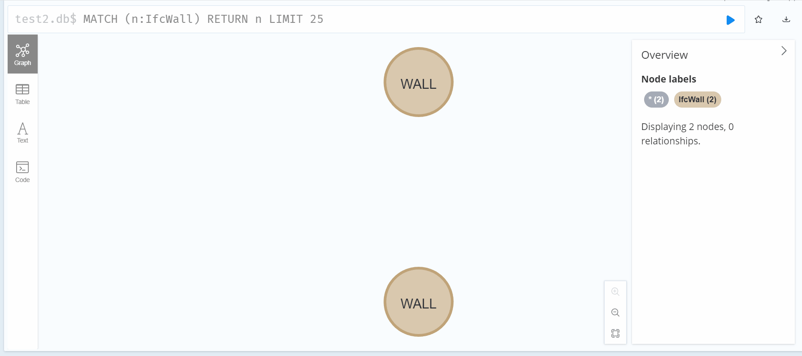

# Simple Ifc AI Agent with GraphRAG

## Overview

`simpleIfcAIAgentWithGraphRAG` is a minimalistic project designed to showcase a simple AI agent that extracts data from an IFC file stored in a graph database (Neo4j). The project demonstrates the integration of AI, IFC file processing, and graph-based data storage and retrieval using modern tools such as Neo4j, LangGraph, and Azure GPT.


The project consists of two primary scripts:
1. **`ifc_to_neo4j.py`**: Parses an IFC file and stores its data in a Neo4j graph database. It organizes IFC entities as graph nodes and their relationships as graph edges.
2. **`chatbot.py`**: Implements an AI agent that answers queries about the IFC file by executing Cypher queries on the Neo4j database.

This project is modular and can be adapted to other databases or in-memory graph representations with minor adjustments.

## How to run

### Prerequisites 

1. Install **Neo4j Desktop** to set up a local Neo4j database.
2. Deploy a ChatGPT model instance via **Azure OpenAI Service**.

### Steps

1. **Set up the Neo4j project**:
   - Open **Neo4j Desktop** and create a new project.
   - Note the connection details (URI, username, password).

2. **Run the project**:
   - Clone this repository:
     ```bash
     git clone https://github.com/your-username/simpleIfcAIAgentWithGraphRAG.git
     cd simpleIfcAIAgentWithGraphRAG
     ```
   - Create a virtual environment and install dependencies:
     ```bash
     python -m venv venv
     venv\Scripts\activate   # On Linux/Mac: source venv/bin/activate
     pip install -r requirements.txt
     ```
   - Update the configuration in `main.py`:
     - Set `neo4j_uri`, `neo4j_user`, and `neo4j_password` to your Neo4j instance details.
     - Set `ifc_file_path` to the path of your IFC file.
     - Adjust `database_name` as needed.

   - Run the application:
     ```bash
     python main.py
     ```

3. **Interact with the chatbot**:
   - The chatbot will launch in a terminal-based interactive mode.
   - Type your query, and the chatbot will translate it into a database query and return the results.
   - To exit, type `exit`, `quit`, or `bye`.
  
4. **(Optional) Inspect your Ifc database in neo4j desktop**



## Limitations

1. Works well only with smaller ifc file, might take ages to upload bigger ifc files to the database
2. LLM Context window limits are easy to achieve - depends on the questions
(a solution for this problem is demonstrated here: https://www.linkedin.com/posts/dmytro-vakulenko-b2a86040_innovation-ifc-ai-agent-variables-activity-7285951367746080768-hRED/ )

## License

This project is licensed under the [MIT License](LICENSE). You are free to use, modify, and distribute this project as per the terms of the license.
